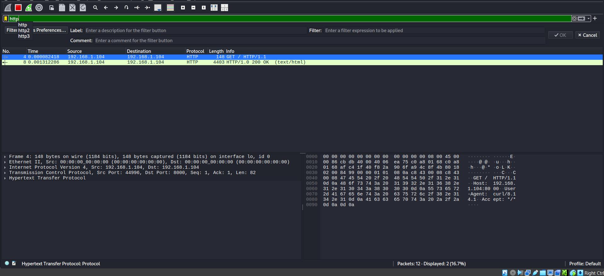
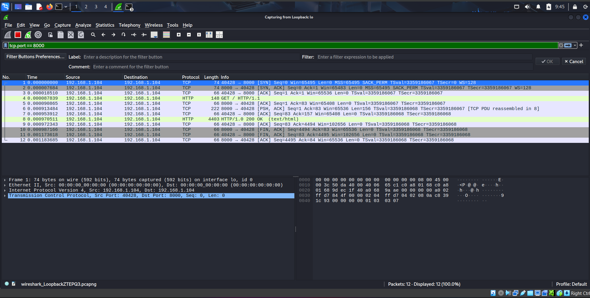
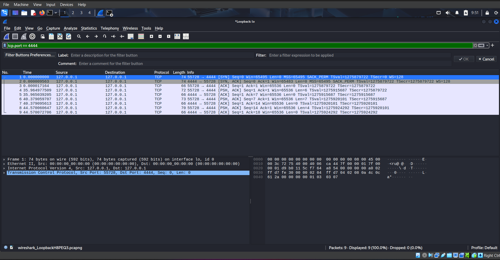

# Wireshark Attack Library

A collection of packet captures and protocol analysis reports demonstrating common network protocols and simulated attack scenarios using Wireshark.

---

## Overview

This repository was created to study how different protocols and attack-related activities appear at the packet level.

Each scenario includes:

* Packet capture files (`.pcapng`)
* Wireshark screenshots
* Individual analysis reports

---

## Scenarios Covered

### ICMP Traffic Analysis

* Echo Requests
* Echo Replies
* Connectivity verification

### DNS Traffic Analysis

* DNS queries
* DNS responses
* Domain resolution

### HTTP Traffic Analysis

* HTTP GET requests
* HTTP 200 OK responses
* HTML content transfer

### TCP SYN Port Scan Analysis

* Three-way handshake
* Open port identification
* Reconnaissance behavior

### Reverse Shell Simulation

* Netcat listener and client communication
* TCP session establishment
* Data transfer analysis

---

## Sample Captures

### HTTP Traffic



---

### Port Scan Analysis



---

### Reverse Shell Simulation



---

## Tools Used

* Wireshark
* Nmap
* Netcat
* Python HTTP Server
* dig
* Ping Utility

---

## Repository Structure

```text
Wireshark-Attack-Library/
│
├── docs/
├── pcaps/
├── screenshots/
├── LICENSE
└── README.md
```

---

## Skills Demonstrated

* Packet Analysis
* TCP/IP Fundamentals
* Protocol Inspection
* Network Reconnaissance
* HTTP Analysis
* DNS Analysis
* ICMP Analysis
* Reverse Shell Traffic Identification

---

## Documentation

Detailed reports are available inside the `docs/` directory.

---

## Educational Purpose

This repository was created for educational purposes to understand packet-level behavior and network security concepts in a controlled lab environment.

## License

Distributed under the MIT License.
